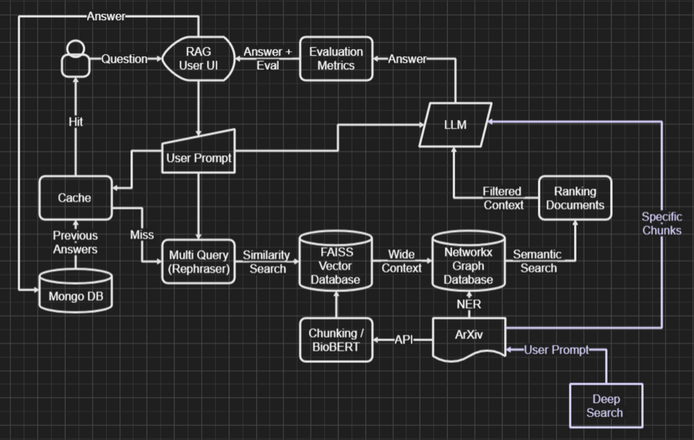

# MDDS - Medical Diagnostic Device Search

## Overview

MDDS (Medical Diagnostic Device Search) is an advanced Retrieval-Augmented Generation (RAG) system designed to provide intelligent search capabilities for medical diagnostic device research. The system combines vector similarity search, knowledge graph traversal, and deep search capabilities to deliver comprehensive and accurate responses to complex medical queries.

## 🏗️ System Architecture

The system implements a multi-layered architecture:



### Core Components

1. **Query Processing Layer**
   - Multi-query generation for comprehensive search coverage
   - Query optimization and expansion using Azure OpenAI

2. **Retrieval Systems**
   - **Vector Database**: FAISS-based similarity search with S-BioBert embeddings
   - **Knowledge Graph**: NetworkX-based rule-based entity relationship mapping
   - **Deep Search**: Real-time ArXiv paper retrieval and processing

3. **Context Integration**
   - Intelligent ranking algorithm combining relevance scores
   - Context deduplication and optimization
   - Source validation and metadata preservation

4. **Response Generation**
   - Azure OpenAI GPT-4o-mini for answer synthesis
   - Automatic citation generation and source linking
   - Quality assessment using RAGAS evaluation metrics

5. **Caching System**
   - MongoDB-based query caching with semantic similarity matching
   - Separate caching strategies for normal and deep search results

## ✨ Key Features

- **Dual Search Modes**: 
  - Normal search for quick responses from pre-indexed content
  - Deep search for comprehensive analysis including real-time paper retrieval
- **Knowledge Graph Integration**: Entity-based context enhancement
- **Automatic Source Citation**: Google Scholar link generation
- **Quality Assessment**: Built-in evaluation metrics for answer quality
- **Intelligent Caching**: Semantic similarity-based result caching
- **Interactive UI**: Modern Streamlit-based interface with dark mode support

## 🚀 Getting Started

### Prerequisites

- Python 3.8 or higher
- MongoDB Atlas account
- Azure OpenAI API access

### Installation

1. **Clone the repository**
   ```bash
   git clone <repository-url>
   cd DePaulProject
   ```

2. **Create and activate virtual environment**
   ```bash
   python -m venv .venv
   source .venv/bin/activate  # On Windows: .venv\Scripts\activate
   ```

3. **Install dependencies**
   ```bash
   pip install -r requirements.txt
   ```

4. **Extract compressed files**
   ```bash
   # Extract the sentence transformer model
   unzip model.zip -d content/
   
   # Extract knowledge graph (if needed)
   unzip knowledge_graph\(3\).gexf.zip
   ```

5. **Configure environment variables**

   Create a `.env` file in the project root:
   ```env
   OPENAI_API_KEY="your-azure-openai-api-key"
   MONGO_URI="your-mongodb-connection-string"
   ```

   Create `.streamlit/secrets.toml`:
   ```toml
   AZURE_OPEN_AI_KEY="your-azure-openai-api-key"
   MONGO_URI="your-mongodb-connection-string"
   ```

6. **Set up Azure OpenAI**
   - Ensure you have access to GPT-4o-mini model
   - Update the endpoint and deployment name in `main.py` if different:
     ```python
     endpoint = "https://aoai-camp.openai.azure.com/"
     deployment = "abbott_researcher"
     ```

7. **Set up MongoDB**
   - Create a MongoDB Atlas cluster
   - Add your connection string to the environment files
   - The system will automatically create the required collections

### Running the Application

1. **Start the Streamlit application**
   ```bash
   streamlit run streamlit_app.py
   ```

2. **Access the application**
   - Open your browser to `http://localhost:8501`
   - Use the interface to perform searches on medical diagnostic devices

## 📖 Usage

### Normal Search
- Best for quick queries using pre-indexed medical literature
- Utilizes vector similarity search and knowledge graph filtering
- Provides fast responses with quality assessment

### Deep Search
- Comprehensive search including real-time ArXiv paper retrieval
- Breaks down complex queries into multiple sub-queries
- Combines local knowledge base with latest research papers
- Takes longer but provides more thorough coverage

### Search Tips
- Use specific medical device names for better results
- Ask comparative questions (e.g., "What is the best glucose monitor?")
- Include context about intended use or patient population

## 🔧 Technical Details

### Models and Embeddings
- **Sentence Transformer**: `pritamdeka/S-BioBert-snli-multinli-stsb`
- **Vector Database**: FAISS with L2 normalization
- **Language Model**: Azure OpenAI GPT-4o-mini

### Data Sources
- Pre-indexed medical literature chunks
- Real-time ArXiv paper retrieval
- Knowledge graph with medical entities and relationships

### Evaluation Metrics
The system includes built-in evaluation using RAGAS metrics:
- Answer relevancy
- Faithfulness to source material
- Context precision and recall
- Answer correctness and similarity

## 📁 Project Structure

```
├── main.py                 # Core search functions
├── streamlit_app.py        # Web interface
├── UserQuery.py           # Query processing and expansion
├── ContextRetrieval.py    # Vector and graph-based retrieval
├── DeepSearch.py          # Real-time ArXiv search
├── Ranking.py             # Context ranking algorithm
├── CacheDB.py             # Database model for caching
├── CacheHit.py            # Cache similarity matching
├── ScholarLink.py         # Google Scholar link generation
├── Evaluation.py          # Answer quality assessment
├── architecture.png       # System architecture diagram
├── chunks_with_entities(1).json  # Pre-processed text chunks
├── chunks(1).index        # FAISS vector index
├── knowledge_graph(3).gexf # Medical entity knowledge graph
├── model.zip              # Compressed sentence transformer model
└── content/               # Model files after extraction
```

## 🤝 Contributing

1. Fork the repository
2. Create a feature branch (`git checkout -b feature/AmazingFeature`)
3. Commit your changes (`git commit -m 'Add some AmazingFeature'`)
4. Push to the branch (`git push origin feature/AmazingFeature`)
5. Open a Pull Request

## 📝 License

This project is licensed under the MIT License - see the LICENSE file for details.

## 🆘 Troubleshooting

### Common Issues

1. **ModuleNotFoundError**: Ensure all dependencies are installed via `pip install -r requirements.txt`

2. **FAISS Index Error**: Make sure `chunks(1).index` file is present and not corrupted

3. **MongoDB Connection Issues**: Verify your MongoDB URI and network access

4. **Azure OpenAI API Errors**: Check your API key and endpoint configuration

5. **Model Loading Issues**: Ensure `model.zip` is properly extracted to the `content/` directory

### Performance Optimization

- For faster startup, ensure the FAISS index and knowledge graph files are in the correct location
- Consider using GPU acceleration for the sentence transformer model in production
- MongoDB indexes are automatically created for optimal caching performance

## 📞 Support

For questions or issues, please:
1. Check the troubleshooting section above
2. Review the error logs in the Streamlit interface
3. Open an issue on the repository with detailed error information

---

**Don't search harder. Search smarter.** 🔬