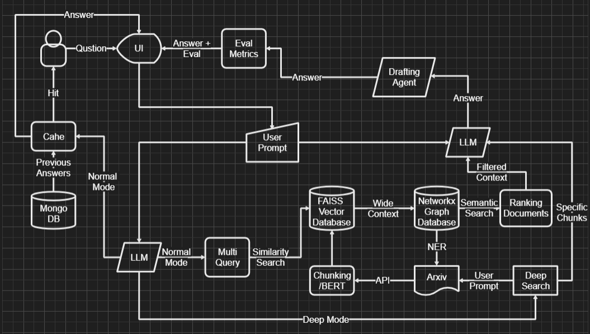

# MDDS - Medical Diagnostic Device Search

## Overview

MDDS (Medical Diagnostic Device Search) is an advanced Retrieval-Augmented Generation (RAG) system designed for intelligent medical diagnostic device research. Built with a modern MCP (Model Context Protocol) architecture, the system provides three distinct search modes: normal search for quick responses, deep search for comprehensive analysis, and intelligent search that automatically selects the optimal method based on query complexity.

## 🏗️ Architecture

The system is built on a client-server architecture using the Model Context Protocol (MCP):

- **Frontend**: Modern web interface with real-time search capabilities
- **Express Server**: Node.js server handling HTTP requests and MCP client management  
- **MCP Server**: Python-based server providing advanced search tools and AI capabilities
- **Data Layer**: FAISS vector database, NetworkX knowledge graph, and MongoDB caching



## 🚀 Getting Started

### Prerequisites
- Node.js (v14 or higher)
- Python 3.8+ with virtual environment
- MongoDB Atlas account (for caching)
- Azure OpenAI API access

### Setup and Installation

1. **Install Node.js Dependencies**
   ```bash
   npm install
   ```

2. **Setup Python Environment**
   ```bash
   python -m venv .venv
   source .venv/bin/activate  # On Windows: .venv\Scripts\activate
   pip install -r requirements.txt
   ```

3. **Environment Configuration**
   Create a `.env` file in the project root:
   ```env
   AZURE_OPEN_AI_KEY="your-azure-openai-api-key"
   MONGO_URI="your-mongodb-connection-string"
   ```

4. **Start the Application**
   
   **Terminal 1 - Start the MCP Server:**
   ```bash
   source .venv/bin/activate
   python src/MCPServer.py
   ```
   
   **Terminal 2 - Start the Express Server:**
   ```bash
   npm start
   ```
   
   Access the application at http://localhost:3000

## ✨ Search Modes

### 1. Normal Search (`normal_search`)
- **Purpose**: Fast responses for straightforward medical device queries
- **Features**: 
  - Vector similarity search using S-BioBert embeddings
  - Knowledge graph entity filtering for relevance
  - Intelligent caching with semantic similarity matching
  - Sub-query generation for comprehensive coverage
- **Best for**: Direct questions about specific devices, quick comparisons, general information

### 2. Deep Search (`deep_search`) 
- **Purpose**: Comprehensive research including real-time scientific literature
- **Features**:
  - All normal search capabilities
  - Real-time ArXiv paper retrieval and processing
  - Extended context analysis (30 items vs 15 in normal)
  - Advanced document processing and chunking
- **Best for**: Complex research questions, latest developments, academic-level analysis

### 3. Intelligent Search (`intelligent_search`)
- **Purpose**: AI-powered decision making between normal and deep search
- **Features**:
  - GPT-4o-mini analyzes query complexity
  - Automatic method selection based on query characteristics
  - Optimal performance without manual mode selection
- **Best for**: When you're unsure which search method to use

## 🔧 Core Technologies

### AI/ML Stack
- **Language Model**: Azure OpenAI GPT-4o-mini (`medical-device-research-model`)
- **Embeddings**: S-BioBert (`pritamdeka/S-BioBert-snli-multinli-stsb`)
- **Vector Database**: FAISS with L2 normalization
- **NLP Processing**: spaCy with English core model
- **Entity Recognition**: Custom medical entity extraction

### Data Infrastructure  
- **Knowledge Graph**: NetworkX-based medical entity relationships
- **Document Processing**: PyPDF2 for scientific paper parsing
- **Caching**: MongoDB with MongoEngine ODM
- **Real-time Search**: ArXiv API integration

### Development Stack
- **Backend**: Python 3.8+ with asyncio support
- **API Layer**: Express.js with MCP protocol
- **Protocol**: Model Context Protocol (MCP) for tool communication
- **Frontend**: Modern HTML5 with responsive CSS
- **Concurrency**: ThreadPoolExecutor for parallel processing

## 🔍 System Components

### Query Processing (`UserQuery.py`)
- Multi-query generation for comprehensive search coverage
- Temperature-controlled response generation (default: 0.5)
- Specialized prompting for medical device contexts

### Context Retrieval (`ContextRetrieval.py`)  
- Dual-mode retrieval: vector similarity + knowledge graph
- Entity-based filtering and relevance scoring
- Configurable search depth (k=15 normal, k=30 deep)

### Deep Search (`DeepSearch.py`)
- Real-time ArXiv paper retrieval
- Keyword extraction and query optimization  
- PDF processing and semantic chunking
- FAISS indexing for rapid similarity search

### Intelligent Ranking (`Ranking.py`)
- Context deduplication and relevance scoring
- Multi-source information integration
- Top-k selection for optimal response generation

### Quality Assessment (`Evaluation.py`)
- RAGAS-based evaluation metrics
- Answer drafting and improvement (threshold: 0.7)
- Faithfulness and relevance scoring

### Caching System (`CacheDB.py`, `CacheHit.py`)
- MongoDB-based semantic caching
- Query similarity matching for cache hits
- Separate caching for normal and deep search results

### Citation Generation (`ScholarLink.py`)
- Automatic Google Scholar link generation
- Source metadata extraction and formatting
- Academic citation support

## � Usage

### Web Interface
1. Open http://localhost:3000 in your browser
2. Use the modern, responsive interface with dark/light mode toggle
3. Enter your medical device query in the search field
4. Results include automatic citations and quality metrics

### API Endpoints

**POST /api/mcp**
```json
{
  "name": "normal_search",
  "arguments": {
    "input_query": "What are the latest glucose monitoring devices?",
    "temp": 0.1
  }
}
```

**Available Tools:**
- `normal_search` - Fast search with pre-indexed content
- `deep_search` - Comprehensive search with real-time papers  
- `intelligent_search` - AI-powered automatic method selection
- `test_search` - Connectivity testing

### Search Tips
- **Specific queries**: "Compare accuracy of CGM devices" 
- **Comparative analysis**: "Pulse oximeter vs smartwatch heart rate monitoring"
- **Latest research**: Use deep search for cutting-edge developments
- **Quick facts**: Normal search for established information

## 🗂️ Project Structure

```
MDDS_real/
├── server.js                 # Express server with MCP client
├── MCPClientManager.js       # MCP protocol client management
├── package.json              # Node.js dependencies
├── requirements.txt          # Python dependencies (171 packages)
├── public/
│   └── index.html           # Modern web interface with dark mode
├── src/                     # Python MCP server modules
│   ├── MCPServer.py         # Main MCP server with search tools
│   ├── UserQuery.py         # Multi-query generation 
│   ├── ContextRetrieval.py  # Vector + graph retrieval
│   ├── DeepSearch.py        # Real-time ArXiv integration
│   ├── Ranking.py           # Context ranking algorithm
│   ├── Evaluation.py        # RAGAS quality assessment
│   ├── CacheDB.py           # MongoDB cache models
│   ├── CacheHit.py          # Semantic cache matching
│   ├── ScholarLink.py       # Citation link generation
│   ├── DrafterAgent.py      # Answer improvement agent
│   └── util.py              # Utility functions
├── data/                    # Pre-processed datasets
│   ├── chunks_with_entities(1).json  # Medical literature chunks
│   ├── chunks(1).index      # FAISS vector index  
│   └── knowledge_graph(3).gexf # Medical entity graph
└── temp/                    # Temporary processing files
```

## 🔧 Configuration

### Azure OpenAI Setup
```python
endpoint = "https://aoai-camp.openai.azure.com/"
deployment = "medical-device-research-model"  
model_name = "gpt-4o-mini"
api_version = "2024-12-01-preview"
```

### MongoDB Configuration
- Database: Automatic connection via `MONGO_URI`
- Collection: `cache` with compound indexes
- Models: `CacheDB` with query/answer/tag structure

### Search Parameters
- **Normal Search**: k=15 contexts, temperature=0.1
- **Deep Search**: k=30 contexts, k_articles=5, k_chunks=7
- **Evaluation Threshold**: 0.7 (triggers answer redrafting)

## 🚀 Performance Features

### Concurrent Processing
- Parallel vector and graph retrieval
- Asynchronous cache checking
- ThreadPoolExecutor for multi-query processing

### Intelligent Caching
- Semantic similarity matching for cache hits
- Separate normal/deep search result storage
- Automatic cache invalidation and updates

### Quality Assurance
- RAGAS evaluation metrics integration
- Automatic answer improvement below 0.7 threshold
- Source validation and metadata preservation

## 🛠️ Development

### Running in Development Mode
```bash
# Terminal 1 - MCP Server with logging
source .venv/bin/activate
python src/MCPServer.py

# Terminal 2 - Express server  
npm run start

# Monitor logs
tail -f mcp_server.log
```

### Testing Connectivity
```bash
curl -X POST http://localhost:3000/api/mcp \
  -H "Content-Type: application/json" \
  -d '{"name": "test_search", "arguments": {"input_query": "test"}}'
```

## 🆘 Troubleshooting

### Common Issues

1. **MCP Connection Failed**
   ```bash
   # Ensure Python virtual environment is activated
   source .venv/bin/activate
   # Check Python path in MCPClientManager.js matches your setup
   ```

2. **ModuleNotFoundError**: 
   ```bash
   pip install -r requirements.txt
   # Ensure all 171+ dependencies are installed
   ```

3. **FAISS Index Error**: 
   ```bash
   # Verify data files exist
   ls -la data/chunks\(1\).index data/chunks_with_entities\(1\).json
   ```

4. **MongoDB Connection Issues**: 
   ```bash
   # Verify MongoDB URI format
   echo $MONGO_URI
   # Check network connectivity to MongoDB Atlas
   ```

5. **Azure OpenAI API Errors**: 
   ```bash
   # Verify API key and endpoint
   echo $AZURE_OPEN_AI_KEY
   # Check deployment name matches configuration
   ```

6. **Server Port Conflicts**:
   ```bash
   # Check if port 3000 is available
   lsof -i :3000
   # Use different port: PORT=3001 npm start
   ```

### Performance Optimization

- **Startup Time**: Ensure FAISS index and knowledge graph files are properly loaded
- **Memory Usage**: Monitor Python process during deep search operations  
- **Concurrent Requests**: MCP server handles one request at a time
- **Cache Performance**: MongoDB indexes automatically created for optimal caching

### Logging and Debugging

```bash
# View MCP server logs
tail -f mcp_server.log

# Enable verbose logging
export LOG_LEVEL=DEBUG

# Test specific search modes
curl -X POST http://localhost:3000/api/mcp \
  -H "Content-Type: application/json" \
  -d '{"name": "test_search", "arguments": {"input_query": "test"}}'
```

## 🤝 Contributing

1. Fork the repository
2. Create a feature branch (`git checkout -b feature/AmazingFeature`)
3. Follow the existing code style and architecture
4. Add tests for new MCP tools
5. Update documentation for new features
6. Commit your changes (`git commit -m 'Add some AmazingFeature'`)
7. Push to the branch (`git push origin feature/AmazingFeature`)
8. Open a Pull Request

### Development Guidelines

- **MCP Tools**: Add new tools to `MCPServer.py` with proper logging
- **Frontend**: Maintain responsive design and accessibility
- **Documentation**: Update README for any architectural changes
- **Testing**: Include test queries for new search capabilities

## 📝 License

This project is licensed under the ISC License - see the LICENSE file for details.

## 📞 Support

For questions or issues:

1. **Check logs**: Review `mcp_server.log` for detailed error information
2. **Verify setup**: Ensure all environment variables are configured
3. **Test connectivity**: Use the `test_search` tool to verify MCP communication
4. **GitHub Issues**: Report bugs with detailed error logs and system information

## 🔬 Research & Citations

**Academic Use**: This system is designed for medical device research and includes automatic citation generation for academic integrity.

**Data Sources**: 
- Pre-indexed medical literature database
- Real-time ArXiv scientific papers
- Medical entity knowledge graph
- Google Scholar citation links

---

**Don't search harder. Search smarter.** 🔬